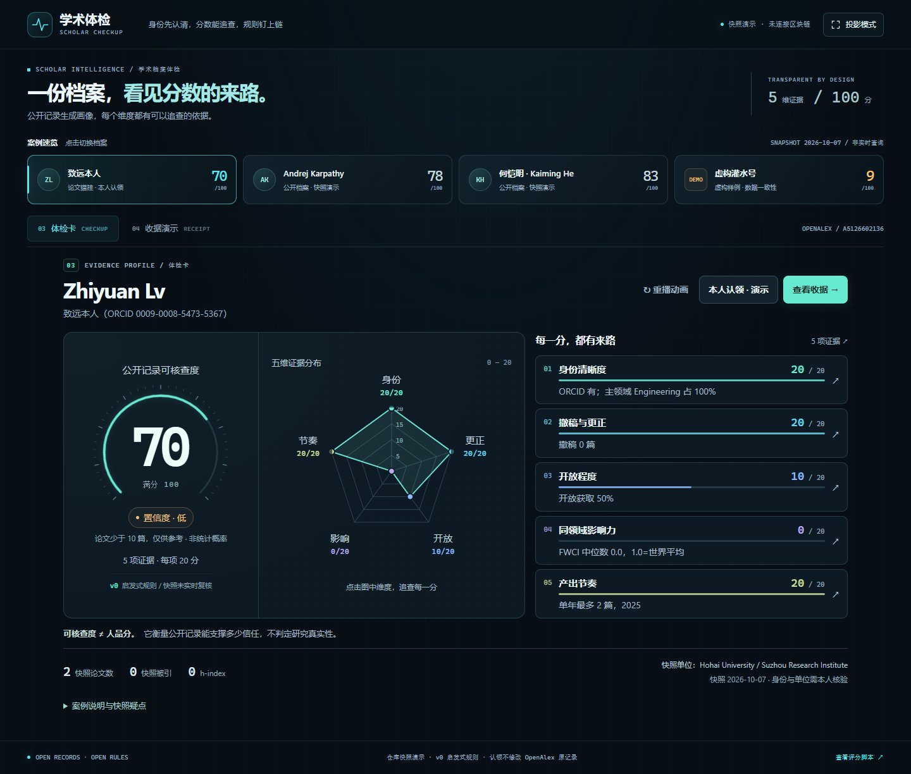

# 学术体检 · 体检卡、评分收据与机构查询

本目录提供夏负责的体检卡，以及按本次用户要求整合的链上评分读取、机构查询、个人任务与专家推荐出口。首页／知识库的队友仍可通过 `card.html?id=作者ID` 接入。新增界面均位于 `aia/ui/`，不改研究工作台、上游评分脚本、合约或学者案例文件。

产品名：**学术体检 · Scholar Checkup**。主标语：**身份先认清，分数能追查，规则钉上链**。



## 本次新增：机构与个人两个入口

- **评分收据**：自动检查 `../chain/deployments/botchain.json`。缺失时显示“未部署 · 快照演示”；配置有效时以 ethers v6 只读查询 BOT Chain 的投稿、审稿、复现、认领和评分记录。不连接钱包、不广播交易，也不把链上任意地址提交的分数覆盖为体检卡的官方评分。
- **机构查询**：打开 `org.html`，输入学者 ID 或完整稿件指纹，查看投稿、审稿、复现、认领时间线。所有行为样例均为虚构，截止时间固定并显示在页面上；同一指纹在滚动 30 天内出现于至少两家机构、同一人近 7 天投稿至少 10 篇，分别触发待核实提示。
- **个人出口**：分数至少 75 展示专家推荐；低于 75 或置信度低展示提分任务。高分推荐仅为演示说明，不表示获得专家资格。任务列明材料和核验方式，认领直接接入原有本地流程。
- **积分口径**：任务的 +5／+3／+8 是待确认的演示贡献积分建议，不计入 v0 五维总分。本人认领未经过 ORCID 核验、任务未经独立验收，不会入账或显示真实上链；致远的 70 分保持原始可核查口径。需要合约与评分负责人确定贡献规则、接入核验后，才能实现真实加分。
- **风险口径**：只提示需要核实的记录，不判定违规、不自动扣分。相同字节的指纹不等于文本相似度检测，也不能仅凭两次登记推断两家机构同时在审。

机构入口与体检卡顶部互通。`org.html` 默认使用 `org-mock.json`，与真实人物的公开评分快照分开；切换“链上只读”后按真实作者 ID 或指纹读取合约，两个来源独立呈现。真实模式先展示原始记录和登记人；机构指纹没有对应的授权核验时，不把任意地址填写的机构字段当成已认证期刊，也不把虚构快照中的风险提示套到真实记录上。

[机构查询预览](docs/org-preview.png) · [个人任务预览](docs/personal-actions.png)。可直接打开 `org.html?mode=chain&q=A5126602136` 进入真实作者的只读查询。

### 真实链上读取与部署交接

已同步队友 `ccb2d69` 的 **ActionRegistry** 协议，使用 `chain/deploy.mjs` 输出的 `{ chainId: 677, address, block, ... }` 及 `chain/artifacts/ActionRegistry.json`。读取前验证网络与地址代码；从 `actionsOf(keccak256("openalex:<ID>"))` 取得行为，从 `Recorded` 事件匹配交易哈希和区块。稿件指纹使用 `actionsByContent(contentHash)`。合约允许任何地址登记，所以列表保留登记人、行为类型和规则，并支持筛选；链上登记本身不等于独立核验通过。

新的链上 Action 不带置信度；只有 `SCORE` 的 `value` 是分数，其余行为不展示为 0 分。`Recorded` 事件没有规则和时间字段，这些字段来自对应的合约记录；重复事件无法唯一对应时不补写交易信息。

一次查询固定读取区块，分段扫描最近至多 20,000 个区块、20 批日志，事件查询总预算 15 秒。范围以外或未能匹配的交易显示缺失，历史不完整时明确提示；RPC、ABI 或配置错误显示失败与重试，不伪装成“没有记录”。无部署时不加载 ethers、不请求主网。部署清单缺失的 HTTP 404 是预期回落路径。

真实记录链接使用 [BOT Chain 官方文档](https://dev-docs.botchain.ai/docs/Developers/quick-guide/) 指定的主网浏览器；事件读取依照 [ethers 合约 API](https://docs.ethers.org/v6/api/contract/)。原来的 SHA-256 本地快照保留在单独区域，标明演示、不广播交易。

**当前仍需部署方完成**：Gas、合约部署、提交第一条真实评分，并将部署 JSON 提交到仓库。界面读取不需要 Gas；真实主网验收必须等待有效部署。本次不扩展行为合约、不创建钱包、不代签交易。

## 体检卡交互优化（2026-10-07）

- 桌面核心区采用三列：环形总分、交互雷达、五维证据；同一维度保持一致的颜色。低置信度使用琥珀提示，并保留数据不足的说明。
- 雷达上的五个维度可直接点击，也支持 Tab、Enter 和空格；焦点或悬停会同步强调对应的证据行。
- 证据弹窗可用“上一项／下一项”或左右方向键连续查看五维；Esc 关闭后回到原触发位置。
- “投影模式”收起介绍区，扩大核心信息；Esc 可退出，打开证据弹窗时会先关闭弹窗。“重播动画”只重播数字和图表，不重新计算分数。
- 同一页面里切换案例会保留各自的收据和认领状态，重复点当前案例也不会清空。**刷新或离开页面仍会清空演示状态**，需要保留的收据请先导出。
- 未知学者 ID 明确提示“未找到档案”，不默认替换为另一个人；支持完整 OpenAlex 作者 URL。默认数据加载失败后可以直接重试，也可手动选择 JSON。

[查看投影模式截图](docs/card-presentation.png)。本轮保留原始评分、案例数据和其他队友的收据／链模块。

## 启动与演示

从仓库根目录启动静态服务，无需安装依赖或构建：

```sh
python -m http.server 8878 --bind 127.0.0.1 --directory aia
```

打开 <http://127.0.0.1:8878/ui/card.html?id=A5126602136>，会进入对应案例的独立演示。需要从 `aia/` 提供服务，才能读取相邻的 `product/mock_cases.json`。直接双击 `checkup.html` 时提供手动选择这份 JSON 的入口；不内嵌另一份可能过期的案例数据。

1. 选择“致远本人”，查看总分计数、五维雷达和逐条证据。
2. 点击任意维度，查看快照依据、v0 规则及 OpenAlex 原始记录链接。
3. 进入“评分收据”，检查链上读取状态；在“本地快照与本人认领”区域生成 SHA-256 指纹、播放模拟确认、下载 JSON 并核验。
4. 点击“本人认领”，确认**本地模拟签名**，观看墒情论文从错挂档案移动到本人档案；返回体检卡查看本地认领记录及重算说明。
5. 切换其他案例；虚构案例始终标有水印，不能跳往虚构的 OpenAlex 页面。

哈希计算使用浏览器 Web Crypto，需要 localhost、文件模式或 HTTPS 等安全上下文。链上模式只读；本地模拟确认不代表实际交易，本地快照没有区块浏览器链接。文件模式仍可手动加载案例，但链上查询与机构样例请通过静态服务打开。

## 数据与评分处理

- 唯一案例源为 [`../product/mock_cases.json`](../product/mock_cases.json)。真实姓名案例均为该文件的 **2026-10-07 快照**，页面没有实时查询或重新验证人物履历。来源记录自身可能错配。
- 五维评分规则按照 [`checkup.py`](../product/checkup.py) 的 v0 实现说明；不将尚未接入的 Crossref 或其他检测能力写成已经完成。
- 虚构案例源总分为 **21**，五维实际合计为 **9**。页面显示合计 9，同时列出源总分与不一致提示，不修改队友的数据。
- 本人认领不自动给身份维度加分。致远快照原本为 20/20，当前分项合计仍为 **70**；界面重算当前五维、记录本地模拟的 2→3 篇归属。新论文没有完整指标，不能声称完成包含该论文的 v0 全量重算，也不会修改 OpenAlex。
- 置信度沿用快照标签，不能视为统计概率。“可核查度 ≠ 人品分”，高分也不证明论文真实。
- 收据的规则摘要哈希、学者标识哈希、快照哈希与收据哈希均真实计算。规则摘要哈希不是整个 Python 源文件的哈希。区块号和签名流程是演示，JSON 明确包含 `simulation: true`、`chainStatus: "not-submitted"`。

## 与首页／知识库对接

对接入口为 `card.html?id=作者ID`，跳转到独立预览 `checkup.html?case=作者ID`，没有创建或接管队友的 `index.html`、`receipt.html`。共享颜色和字体已定义在 `style.css` 的 `--sc-*` 变量中，组件样式使用独立前缀。

最简单的接法是知识库动画结束后跳转：

```js
location.href = 'card.html?id=A5126602136';
```

支持其余三个案例 ID：`A5009290031`、`A5100700361`、`SYNTHETIC`。

如果要放进同一页面，可以只引入共享变量、core 和两个组件，再把知识库阶段取得的原始案例传入。无需引入独立演示壳 `checkup.js`：

```html
<link rel="stylesheet" href="style.css">
<link rel="stylesheet" href="checkup-card.css">
<link rel="stylesheet" href="checkup-receipt.css">
<script src="checkup-core.js"></script>
<script src="checkup-card.js"></script>
<script src="checkup-receipt.js"></script>
```

```js
let record = ScholarCheckupCore.normalizeCase(rawCase, dataset);
const card = ScholarCheckupCard.mount(cardRoot, record, {
  onReceipt: () => showScreen('receipt'),
  onClaim: () => showScreen('receipt'),
});
const receipt = ScholarCheckupReceipt.mount(receiptRoot, record, {
  onBack: () => showScreen('card'),
  onClaim: current => {
    record = ScholarCheckupCore.recomputeAfterClaim(current);
    card.update(record);
    return record; // 收据组件用返回值更新当前案例
  },
});
// 切换研究时调用 update(record)，移除页面时调用 destroy()。
// 卡片还提供 card.replay()，仅重播动画，不改变 record。
```

在已有独立壳中也可使用 `ScholarCheckup.selectCase(caseId)`、`ScholarCheckup.showView('card' | 'receipt')`、`ScholarCheckup.setPresentation(true | false)`，或发送 `scholar-checkup:select` 事件，detail 为 `{caseId, view?}`。本地认领完成会发出 `scholar-checkup:claimed`，detail 含 `caseId`、`claim`、`score`、`localWorks`、`simulation`；知识库可用它同步论文归属动画。该事件不代表真实身份认证。

新组件可独立复用（各自引入同名 JS 和 CSS）：

```js
const actions = ScholarCheckupActions.mount(actionsRoot, record, {
  onClaim: () => { showScreen('receipt'); receipt.openClaim(); },
});
const chain = ScholarCheckupChain.mount(chainRoot, { id: record.id }, {
  onStatus: state => { /* kind: loading/snapshot/synthetic/ready/partial/error */ },
});
// 按稿件读取：mount(chainRoot, { contentHash: '0x...64位哈希' }, options)
// 两者都支持 update(value) / destroy()；chain 还支持 reload() / getStatus()。
// 认领回调更新 record 后，也调用 actions.update(record)。
```

## 验证

```sh
node --test aia/ui/tests/checkup-core.test.cjs aia/ui/tests/checkup-chain.test.cjs aia/ui/tests/checkup-actions.test.cjs aia/ui/tests/org-core.test.cjs
```

本次整合通过 **38 项测试**（原核心 8 项、链上读取 15 项、个人出口 6 项、机构规则 9 项）。包括 75 分边界、高分低置信度的双出口、未核验贡献不入账、30 天／7 天边界、重复与未来记录排除、未知对象空结果、RPC 失败和过时响应隔离。

浏览器使用真实 CDN ethers 6.17.0 与仓库 ActionRegistry ABI、模拟 RPC 响应，验证了正确的学者 keccak256、同一区块 `eth_call`、五种行为、`Recorded` 解码与对应交易链接；另验证网络不匹配报错、重试后未部署回退、本地收据核验、跨案例状态保留及 390px 收据布局。**该测试不代表主网合约已经部署或存在测试中的交易**。清除测试拦截后，正常页面显示未部署。无脚本异常；未部署清单的预期 404 在浏览器网络控制台可见。

个人出口的 320/390px 布局、任务弹窗和键盘焦点、认领取消后重试、高分且低置信度同时出现两出口均已验收。机构页的指纹查询、证据定位、12 篇频次提示、真实 ID 空结果、HTTP 500 后重试均已走通，虚构快照模式控制台无错误。

ActionRegistry 的 `actionsByContent` 浏览器验证使用真实 ABI 和模拟 RPC 返回两条相同指纹的投稿；评分/投稿筛选、390px 实际记录布局、未部署重试、返回虚构模式无数据串入均通过。另验证延迟响应期间切回虚构模式，旧链上结果不能覆盖当前页面。

2026-10-07 已通过 **8 项自动测试**：五维与总分一致性、原始输入不变、认领幂等、真实 SHA-256 绑定和收据篡改识别等。浏览器已走通证据弹窗、模拟收据生成／核验／导出、本人认领及前后快照变化；390px 视口无横向溢出，弹窗 Escape 后焦点返回，控制台无错误。自动浏览器限制了 `file:` 导航，因此双击模式未做完整浏览器验收，建议演示时使用上述静态服务。

本轮 UI 优化后再次通过 8 项自动测试；浏览器新增验证五个雷达点击区、键盘打开证据、连续翻页、投影与弹窗的 Esc 行为、减少动态效果、320px／390px 布局，以及重复选中和跨案例切换后收据哈希不变。无效 ID、完整 OpenAlex URL、模拟 HTTP 500 后重试恢复均已验证；正常页面控制台无错误。

## 交接给数据／合约端

新入库的 [`aia/chain`](../chain/README.md) 使用 **keccak256**：学者标识为 `keccak256("openalex:<作者ID>")`，快照为完整卡片 JSON 的规范化哈希。这里的 **SHA-256 本地完整性收据不能直接当作合约输入**；二者协议和用途不同。真实接入请按 `chain/lib.mjs` 重新构造字段，同时保留原始卡片，不直接使用本页的 `subjectIdHash`、`snapshotHash` 或 `rulesHash` 广播。

后续需要论文级原始指标才能完成认领后的全量评分，并需要明确的规则版本切换。部署合约后，链上组件从实际记录和事件读取网络、交易哈希与区块；当前演示计数不用于这些字段。不请求钱包签名、不广播交易，不修改 Issue 指派或协作者。
