<p align="center"></p>

<h1 align="center">AIA 社区白皮书</h1>
<p align="center"><b>AIA Commons Whitepaper</b><br>灋廌覈鑒 · 獬豸协议（Xiezhi Protocol）<br>以学术信誉链守护注意力、想法与行动 · 在知行社中运行 · 以廌点记录贡献<br>正式版 · 2026 年 10 月</p>

---

**怎么读这份白皮书**

| 你有多少时间 | 读哪里 |
|---|---|
| 2 分钟 | 第 0 节「执行摘要」：是什么、能做什么、还不能做什么 |
| 20 分钟 | 第 1–12 节正文：每节先给结论，再讲流程和依据，最后写限制 |
| 要复核 | 附录：合约字段、评分公式、部署记录、复算命令 |

**本白皮书**：《AIA 社区白皮书》（AIA Commons Whitepaper），描述獬豸协议及运行在其上的知行社。

**状态标签**：全文用文字标签区分功能状态，不靠颜色。
**【已实现】** = 代码已完成，可在演示环境运行；**不等于**已在机构生产环境上线。
**【规划中】** = 规则已定或方案已写，尚未实现。

**名称说明**

| 名称 | 是什么 | 英文 |
|---|---|---|
| **灋廌覈鑒**（读作「法廌核鉴」） | 协议全名：以獬豸之法，核实明鉴 | Xiezhi |
| **獬豸协议** | 协议简称 | Xiezhi Protocol |
| **学术信誉链** | 协议的底层：每位学者一条**个人链**，记录在 BOT Chain 上 | Academic Reputation Chain |
| **AIA** | 理念：Attention（注意力）· Idea（想法）· Act（行动） | AIA |
| **知行社** | 运行在学术信誉链之上的社区 | AIA Commons |
| **廌点** | 社区里流转的贡献记账单位，不能转让、不能买卖 | Zhi Point |
| **灋廌学术分** | 350–950 的学术信誉评分 | Xiezhi Score |

一句话：**獬豸协议（灋廌覈鑒）以学术信誉链为底层，在知行社中实现 AIA，用廌点记录每一份可验证的贡献。**

---

<div class="pb"></div>

## 0. 执行摘要

**是什么**：AIA 把学术协作看成三种稀缺资源：**Idea（想法）**、**Attention（注意力）**、**Act（行动）**。**獬豸协议（灋廌覈鑒，Xiezhi Protocol）**是它的协议实现，底层是**学术信誉链**：为每位学者建立一条可核对的**个人链**，记录身份、论文归属、评分依据和学术行为。在此之上，社区**知行社**让投稿、审稿、复现、核对被看见、被记账；贡献用**廌点**记录，不能转让、不能买卖，不是虚拟货币。

**一句话架构**：**底层是学术信誉链**（每位学者一条个人链，记录在 BOT Chain 上）→ **上面运行知行社**（Idea、Attention、Act 三个区）→ **廌点在社区里流转**（做了可验证的事就发，用于押金、投稿费和兑换激励）。

<p align="center">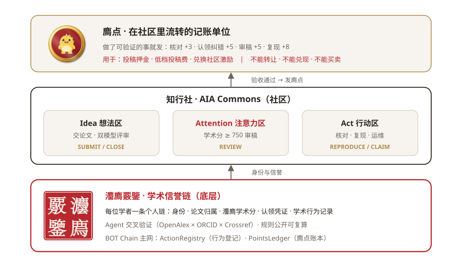<br><sub>图 1 · 产品架构：学术信誉链是底层，知行社在其上运行，廌点在社区里流转</sub></p>

**解决什么**

1. **论文挂错人**：同名学者的论文在公开学术库里经常错挂，或一个人被拆成多个档案
2. **注意力被灌水稿耗尽**：AI 让投稿量激增，审稿人没有变多；「每人限投 N 篇」可以靠互相挂名绕过
3. **复现与核对没人做**：这些工作没有回报，也没有公开记录

**适用对象**：学者（查自己、认领论文、留下可核对的记录）；期刊与会议（收稿登记、一稿多投提示）；高校、基金与招聘方（批量核验，【规划中】）。

**当前能力**

| 能力 | 状态 |
|---|---|
| 输入姓名或 ORCID，Agent 实时检索，并对 OpenAlex、ORCID、Crossref 三方交叉验证，提示错挂与档案拆分 | 【已实现】 |
| 灋廌学术分（350–950）：规则公开、带版本号、可复算 | 【已实现】 |
| 本人认领：逐篇确认 → 邮箱验证码 → 认领凭证 → 凭证指纹写入链上 → 任何人可复核 | 【已实现】（邮件为演示模式，见 4.2） |
| 稿件结构预检与指纹登记；两家期刊登记同一指纹时提示疑似一稿多投 | 【已实现】 |
| 廌点发放与扣减（链上账本，无转账功能） | 【已实现】 |
| 两个合约部署在 BOT Chain 主网，评分、认领、积分、稿件登记都有真实交易 | 【已实现】 |
| 押金合约、审稿与复现任务、双模型论文评审、Agent 接入、真实邮件验证、ORCID 登录授权 | 【规划中】 |

**主要限制**：评分只反映**公开学术记录的可信程度**，不是人品评价，也不代替同行评议；数据覆盖受 OpenAlex 收录范围影响；评分有效性目前只有自动验收和有限样本，**人工盲评尚未完成**；12 个月的效果数字是**机制模拟**，不是真实运营结果。

**下一步**：押金合约、ORCID 登录授权、真实邮件验证，以及首批期刊接入收稿登记。

---

<div class="pb"></div>

## 1. 问题

### 1.1 想法变多了，注意力没变

AI 写作工具让一篇论文的成本大幅下降。ICLR 2026 收到约 1.9 万篇有效投稿，2027 年截止前登记的摘要超过 6 万篇（公开报道），审稿人数量没有同比例增长。大会的应对办法是**一刀切**：每人每年最多 20 篇。但篇数可以通过互相挂名分摊给别人，**信誉无法分摊**。

### 1.2 「这篇论文是谁的」都会错

我们在 OpenAlex 中查到：一位作者的论文挂在另一所大学研究燃烧的同名学者名下，本人档案只有 2 篇；另一位学者被拆成两个档案（一个关联 ORCID，一个没有）。这类问题会直接影响任何基于公开数据的评价。

### 1.3 三件没人愿意白干的事

| 工作 | 现在谁在做 | 问题 |
|---|---|---|
| 审稿 | 志愿者 | 没有回报，好审稿人被灌水稿耗尽 |
| 复现 | 几乎没人 | 不产出论文，缺乏动力 |
| 核对纠错 | 几乎没人 | 错挂、参考文献不存在，没人负责 |

### 1.4 为什么用公链记录，而不是中心化评分

| | 中心化信用评分 | 学术信誉链 |
|---|---|---|
| 记录归谁 | 一家公司 | 公链上，不归任何一方 |
| 规则 | 不公开 | 公开、带版本号，修改留痕 |
| 能否复算 | 不能 | 任何人拿快照都能复算 |
| 谁能接入 | 签约合作方 | 任何期刊、任何应用 |
| 运营方停止服务 | 记录随之消失 | 记录仍在 |

---

## 2. AIA 愿景与原则

### 2.1 三个保护

| | **保护注意力（Attention）** | **记录想法（Idea）** | **保护行动（Act）** |
|---|---|---|---|
| 目标 | 让审稿人的注意力花在更值得的稿子上 | 让有价值的想法被登记、被看见、可追溯 | 让复现、核对、运维被记账、有回报 |
| 协议怎么做 | 按信誉档位设投稿门槛（押金、在审篇数），**不封顶篇数** | 稿件指纹登记、结构预检；投稿前检测【规划中】 | 可验证的任务 → 验收 → 链上记录 → 廌点 |
| 谁提供 | 学术分 ≥ 750 的学者 | 所有作者 | 所有人，尤其想修复信誉的人 |
| 链上记录 | `REVIEW` | `SUBMIT` · `CLOSE` | `REPRODUCE` · `CLAIM` |

三者形成闭环：投稿消耗注意力；注意力只分配给过了门槛的稿子；想提升信誉的人通过行动挣廌点、提升履约，再获得更低的投稿门槛。**新人**做核对和复现，履约上涨；**资深学者**审稿，成为审稿专家；**有失信记录的人**投稿要先押廌点，只能先动手修复信誉。

<p align="center">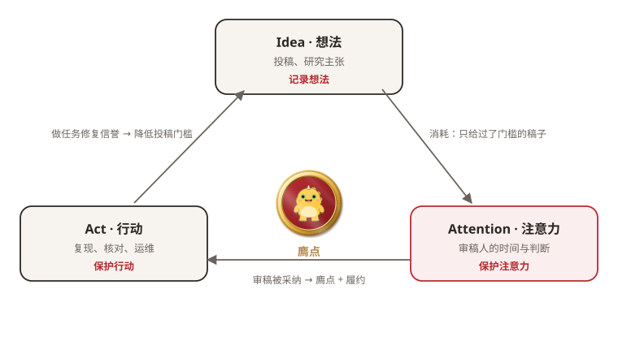<br><sub>图 2 · AIA 循环：想法消耗注意力，注意力只给过了门槛的稿子，行动挣廌点、修复信誉</sub></p>

### 2.2 名字的来源

「法」的古字写作**灋**。《说文解字》：「灋，刑也。平之如水，从水；廌所以触不直者去之，从去。」左边是水，公平如水；右边是**廌**，即獬豸，一种用独角辨别是非的神兽。协议全名「灋廌覈鑒」取「以獬豸之法，核实明鉴」，简称**獬豸协议**，英文 **Xiezhi Protocol**：

| 原则 | 含义 |
|---|---|
| 平之如水 | 规则公开、带版本号，对所有人一致 |
| 触不直者 | 错挂、一稿多投、撤稿、乱答任务都会被识别并留下记录 |
| 核实明鉴 | 每个分数、每张凭证，任何人都能复算核对 |

### 2.3 我们相信的五件事

1. **信誉不属于任何一家公司**：记录在公链上，没有运营方能偷偷修改，包括我们自己
2. **规则公开，谁都能复算**：评分规则开源、带版本号；同一份快照算出同一个分数
3. **人人都有一页，不必等注册**：用公开数据自动建档；本人认领是为了纠错和确认，不是门槛
4. **只记指纹，不记隐私**：链上只放哈希和分数，不放姓名、单位、邮箱
5. **激励绑在行为上，不绑在价格上**：不发币；用廌点记录贡献，不能转让、不能买卖

---

## 3. 业务场景

每个场景按「输入 → 系统处理 → 输出 → 由谁负责后续判断」描述。**系统只给出提示和可核对的记录，最终判断与处置由相应的人或机构负责。**

### 3.1 学者：查自己、认领论文

| 输入 | 系统处理 | 输出 | 责任方 |
|---|---|---|---|
| 姓名、拼音或 ORCID | 检索同名学者；三方交叉验证；按公开规则计算学术分 | 档案、学术分与档位、疑似错挂 / 拆分清单（含置信度与证据） | 学者本人判断哪些论文属于自己 |
| 逐篇「是我的 / 不是我的 / 不确定」+ 邮箱验证码 | 生成认领凭证；凭证指纹与评分写入链上 | 认领凭证；红章（单位邮箱）或灰章「待复核」（非单位邮箱） | 学者对认领声明负责；争议进入复核 |

### 3.2 期刊与会议：收稿登记与一稿多投提示

| 输入 | 系统处理 | 输出 | 责任方 |
|---|---|---|---|
| 收到的稿件（文件） | 计算稿件指纹；结构预检（标题、摘要、参考文献、DOI） | 指纹登记记录（`SUBMIT`）；预检结果 | 期刊决定是否登记、何时登记 |
| 其他期刊登记的同一指纹 | 按指纹查询链上记录 | **疑似一稿多投提示** | **期刊负责核查与处置**；系统不作违规认定 |
| 结案结果 | 登记 `CLOSE` | 结案记录，影响作者履约 | 期刊 |

> 当两家期刊登记相同稿件指纹时，系统提示疑似一稿多投。稿件红章表示「指纹已登记且结构预检通过」，**不代表论文内容真实，也不代表通过同行评议**。

### 3.3 高校、基金与招聘方：批量核验【规划中】

对一批申请人或候选人批量读取档案、认领状态与履约记录。接口形式、授权范围和数据协议需与机构共同确定（见第 10 节）。

---

<div class="pb"></div>

## 4. 协议机制

### 4.1 学术档案与交叉验证【已实现】

数据分三层，解决「没人上传就没用」的冷启动：

| 层 | 谁写 | 内容 |
|---|---|---|
| 公开档案 | 平台 / 任何人 | 用公开数据自动建档、打分；人人都有一页 |
| 本人认领 | 学者自愿 | 逐篇确认论文、纠正错挂 → 认领凭证 |
| 机构登记 | 期刊 | 收稿指纹、结案结果 |

Agent 的核验分七步：理解输入 → 定位学者（同名时列出候选供选择）→ 核对 ORCID 官方雇主 → 拉取论文 → **交叉验证** → 计算学术分 → 等待本人认领。交叉验证综合三类证据：是否同单位署名、两个档案的 ORCID 是否冲突、本人 ORCID / Crossref 是否登记了这篇论文，给出「错挂到他人名下」或「疑似同一人被拆成两个档案」两种判定之一，并附置信度（高 / 中）与证据列表。

<p align="center">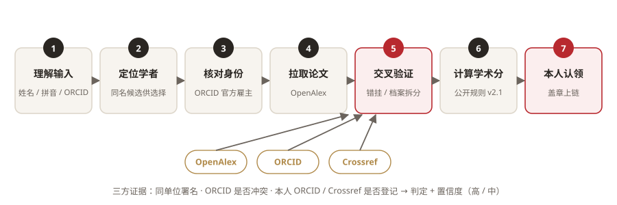<br><sub>图 3 · Agent 核验七步：第 5 步汇总 OpenAlex、ORCID、Crossref 三方证据</sub></p>

<p align="center">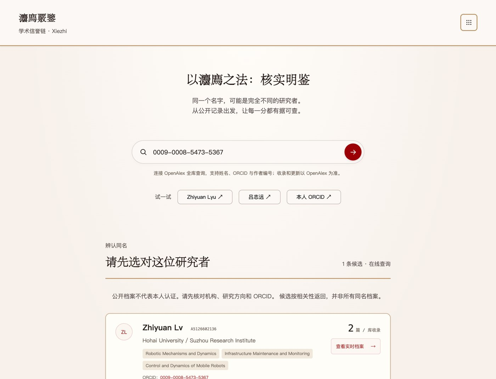<br><sub>图 4 · 真实界面：输入 ORCID，列出候选学者（演示环境，数据来自 OpenAlex 实时查询）</sub></p>

<p align="center">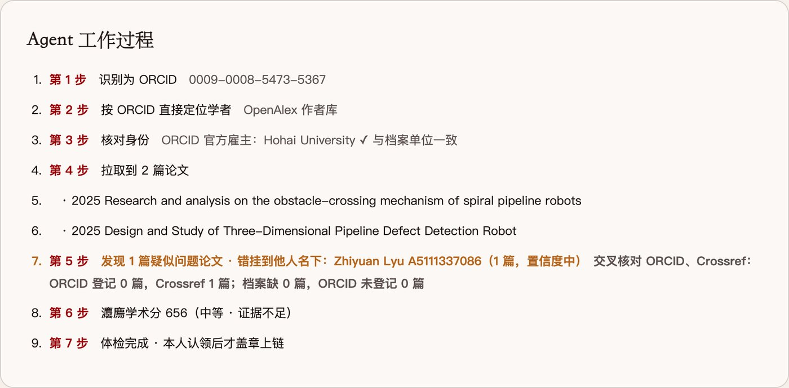<br><sub>图 5 · 真实界面：Agent 工作过程，第 5 步发现 1 篇论文错挂到他人名下（演示环境）</sub></p>

<p align="center">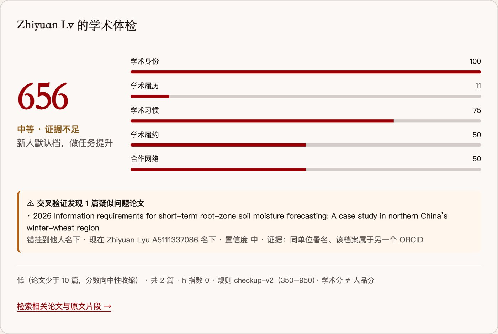<br><sub>图 6 · 真实界面：学术体检结果与五维分数（演示环境）</sub></p>

### 4.2 身份核验与本人认领【已实现，邮件为演示模式】

| 步骤 | 说明 |
|---|---|
| 逐篇确认 | 每篇存疑论文由本人选择「是我的 / 不是我的 / 不确定」，默认「不确定」，系统不替用户决定；同一档案论文多时可整组选择 |
| 邮箱验证 | 6 位验证码，10 分钟有效、最多尝试 5 次、使用一次作废；自动比对邮箱域名与档案单位官网域名 |
| **当前实现** | **演示模式：未接入邮件服务，验证码直接显示在页面上，页面明确标注。真实邮件发送【规划中】** |
| ORCID 核对 | 填写的 ORCID 与档案不一致则拒绝，且不消耗验证码 |
| 认领凭证 | 包含档案、认领与排除的论文、学术分、验证方式、签发时间；**邮箱只存哈希** |
| 上链 | 凭证指纹（`CLAIM`）与评分（`SCORE`）写入链上；单位邮箱盖红章「本人认领」，非单位邮箱盖灰章「待复核」 |
| 复核 | 任何人可提交凭证原文，系统重算指纹并与链上记录比对；凭证任一字段被改动即显示「不一致」 |

邮箱验证只证明「能收到这个邮箱的信」，不等于实名认证；ORCID 登录授权【规划中】将提供更强的身份证据。

<p align="center">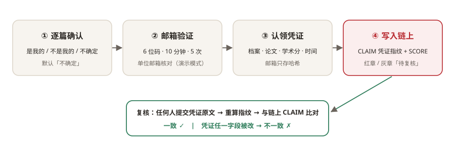<br><sub>图 7 · 本人认领与复核流程</sub></p>

<p align="center">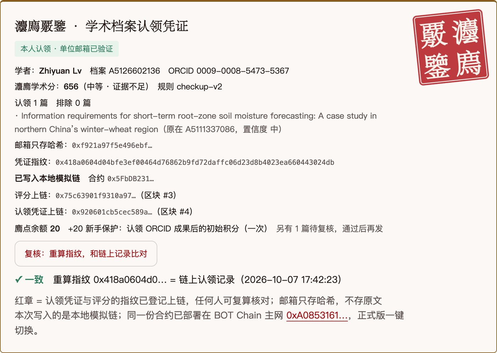<br><sub>图 8 · 真实界面：认领凭证、红章、链上交易与复核结果「一致」（演示环境，本地模拟链）</sub></p>

### 4.3 三条流程

**Idea：投稿登记**

| 步骤 | 状态 |
|---|---|
| 稿件结构预检、计算指纹 | 【已实现】 |
| 按作者档位决定门槛（押金、在审篇数） | 【规划中】（押金合约） |
| 期刊登记指纹；同一指纹多次登记 → 疑似一稿多投提示 | 【已实现】 |
| 结案登记 | 【已实现】；押金退回 / 没收【规划中】 |
| 投稿前双模型检测（水文风险、创新点、ARA 格式、完整度、可复现性） | 【规划中】（见第 6 节） |

**Attention：审稿**【规划中】：学术分 ≥ 750 可接审稿，≥ 830 为审稿专家；只有通过 Idea 门槛的稿子进入审稿池；审稿意见被采纳后记 `REVIEW`、发廌点、提升履约；超时放弃降低履约；利益冲突需回避。

**Act：复现、核对、纠错**：任务、防作弊方式与廌点数额见 5.2。

### 4.4 灋廌学术分【已实现，v2.1 冻结】

| 维度 | 权重 | 看什么 | 数据来源 |
|---|---|---|---|
| 学术身份 | 20% | 是否有 ORCID；官方雇主与档案单位是否一致；研究领域一致性 | ORCID、OpenAlex |
| 学术履历 | 30% | 领域归一化引用（同行认可）；成果积累（50 篇封顶） | OpenAlex |
| 学术习惯 | 20% | 开放获取比例；产出节奏（单年超过 20 篇开始扣分） | OpenAlex |
| 学术履约 | 20% | 投稿结案、审稿、复现、任务，由链上记录驱动；首次进入记中性 | 本链 |
| 合作网络 | 10% | 合作者本身的可信度（当前记中性，【规划中】） | — |

三个关键设计：

- **证据少不下结论**：论文少的学者，公开数据部分向中性收缩（权重 = 论文数 /（论文数 + 10））；新人默认落在「中等 · 证据不足」
- **履约不收缩**：链上行为是直接证据，与论文数量无关
- **撤稿不一票否决**：总分乘以 `1 − min(0.7, 3 × 撤稿率)`，压低上限但可通过履约修复

<p align="center">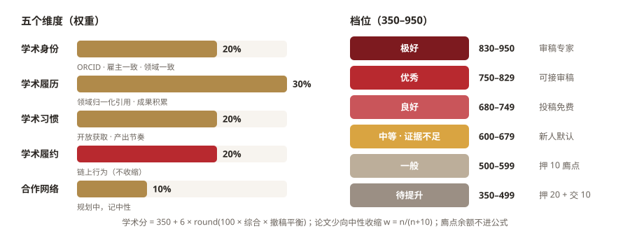<br><sub>图 9 · 灋廌学术分：五个维度的权重与六个档位</sub></p>

完整公式见附录 B；档位与权益见 5.3。

---

<div class="pb"></div>

## 5. 廌点：给行动记账

<p align="center"></p>

> 我们用「**廌点**」记账：做了可验证的事就发，**不能转让、不能兑现、不能买卖**。它是链上记账，不是虚拟货币。

**廌**是獬豸的本字，金币上那只独角小兽就是它。

### 5.1 两本账：知与行

| | **灋廌学术分（知）** | **廌点（行）** |
|---|---|---|
| 记什么 | 公开学术记录有多可信 | 为社区做了多少可验证的事 |
| 范围 | 350–950，六个档位 | 从 0 开始累计，可发可扣 |
| 怎么来 | 公开数据 + 链上履约，按公开规则计算 | 只有一条路：完成并通过验收的任务 |
| 能干什么 | 决定档位：投稿要不要押金、能不能接审稿 | 交押金、交低档投稿费、兑换社区激励 |
| 能否购买 | 不能 | 不能（合约没有转账功能） |
| 互相影响 | 廌点余额**不进**学术分公式 | 档位决定能接哪些任务 |

打个比方：学术分像**体检报告**，廌点像**志愿服务时长**。体检报告买不来，服务时长也不能转给别人。

### 5.2 怎么挣（规则版本 `points-v0`）

| 做了什么 | 廌点 | 条件 | 状态 |
|---|---|---|---|
| 新手保护：第一次个人上链 | +20 | 一次；认领的档案里至少有 1 篇论文（零论文账号拿不到） | 【已实现】 |
| 认领并纠正一篇错挂论文 | +5 | 交叉验证「高」置信 + 单位邮箱；其余待复核通过再发；每次最多 3 篇 | 【已实现】 |
| 核对题：「这篇论文是不是这位作者的？」「这条参考文献存在吗？」 | +3 / 题 | 同题多人比对一致；混入已知答案的暗题；每月最多 30 | 【规划中】 |
| 审稿被采纳 | +5 | 学术分 ≥ 750 才能接 | 【规划中】 |
| 复现一个研究主张 | +8 | 独立复跑对得上（结果不一致但工作合格也给）；作者、执行者、核查者三人分离 | 【规划中】 |
| 运维、数据纠错 | +2 | 抽查 | 【规划中】 |

每一笔都带**原因编号 + 证据指纹**（例如认领的证据是认领凭证的哈希），任何人可以拿原文重算核对。

<p align="center">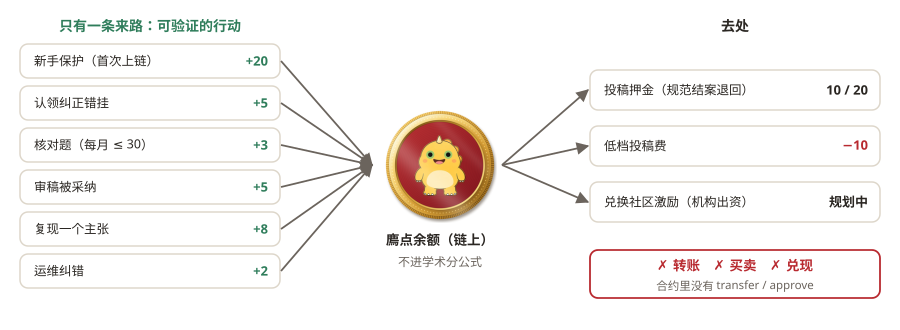<br><sub>图 10 · 廌点只有一条来路（可验证的行动），去处是押金、投稿费与兑换；不能转账、买卖、兑现</sub></p>

### 5.3 怎么用：档位、押金与权益

| 档位 | 学术分 | 投稿 | 押金（廌点，规范结案全额退回） | 其他 |
|---|---|---|---|---|
| 极好 | 830–950 | 免费、期刊优先 | 0 | 审稿专家 |
| 优秀 | 750–829 | 免费、期刊优先 | 0 | 可接审稿 |
| 良好 | 680–749 | 免费 | 0 | |
| 中等 · 证据不足 | 600–679 | 免费 | 0 | 新人默认 |
| 一般 | 500–599 | 免费 | 10【规划中】 | 同时在审最多 2 篇 |
| 待提升 | 350–499 | 投稿费 10【已实现】 | 20【规划中】 | 同时在审最多 1 篇 |

押金规则【规划中】：结构预检不通过 → 退回一半；**确认一稿多投 → 全部没收**；正常结案（录用或拒稿）→ 全额退回。兑换【规划中】：审稿费减免、快速通道、实物激励等，**由合作期刊与机构出资**。

**规则的落脚点**：诚实的学者（新人、资深学者）**不需要花一分廌点**；想大量投稿的人，每多投一篇都要先付出行动。篇数不封顶，注意力只花在过了门槛的稿子上。

### 5.4 看得见的廌点

- **金币落下**：认领盖章或任务验收通过时，一枚獬豸金币落到余额上，并显示「+N 廌点」【已实现：认领页】
- **彩蛋 · 金币雨**：查到学术分 700 以上的学者时，页面下一阵金币雨【已实现】
- 金币雨**只是动画，不额外发放廌点**；廌点只来自可验证的行动

<p align="center"><br><sub>图 11 · 真实界面：查到高分学者时的「廌点雨」彩蛋（演示环境，纯动画）</sub></p>

### 5.5 防作弊：数学核验

**对任何行为序列都成立的六条性质**（脚本可复跑，见附录 D）

| # | 性质 | 结果 |
|---|---|---|
| A1 | 廌点余额永不为负（合约扣减要求余额足够） | 成立 |
| A2 | **廌点买不到学术分**（余额不进分数公式） | 成立 |
| A3 | 刷核对任务涨分有上限：每月最多 +6 分 | 成立 |
| A4 | 撤稿压低天花板但不归零：撤稿率 10% → 最高 770 | 成立 |
| A5 | 单调：履约越好分越高，撤稿越多分越低 | 成立 |
| A6 | 廌点不能转让（合约无转账与授权功能，自动测试断言） | 成立 |

**12 个月机制模拟**（新人 100、资深学者 20、有大量撤稿者 10、灌水者 10、零论文小号 50）

| 规则 | 后三类人合计占用的审稿注意力 |
|---|---|
| 一刀切（每人每年 20 篇） | 63% |
| 本协议第一版规则 v1 | 80%（核验发现比一刀切更差，已修正） |
| **现行规则 v1.2** | **30%**；零论文小号 **0 篇**进入审稿 |

<p align="center">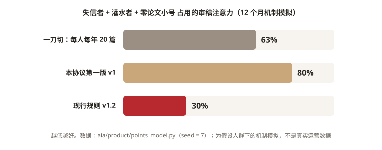<br><sub>图 12 · 机制模拟：后三类人占用的审稿注意力，越低越好</sub></p>

| 人群 | 学术分 开始 → 12 个月 | 档位 | 人均花费廌点 |
|---|---|---|---|
| 新人 | 656 → 716 | 良好 | 0 |
| 资深学者 | 788 → 848 | 极好 | 0 |
| 有大量撤稿者 | 464 → 470 | 待提升 | 162 |
| 灌水者 | 560 → 500 | 一般 | 67 |
| 零论文小号 | 650 → 650 | — | 0 |

<p align="center">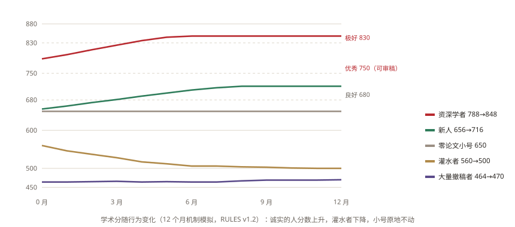<br><sub>图 13 · 机制模拟：五类人群 12 个月的学术分变化</sub></p>

v1 → v1.2 修正了四个问题：小号漏洞、审稿门槛够不着、新人分数涨不动、廌点通胀。**以上是在设定假设下的机制模拟，不是真实运营数据**；仍未覆盖：廌点净增长（建议 12 个月有效期）、一稿多投真实识别率（模拟设为 30%）、多人勾结互审。

### 5.6 我们承诺不做的事

1. **不发行**虚拟货币或代币，不做 ICO、IEO、空投，不募资
2. 廌点**不能转让、不能兑现、不能买卖**，不提供兑换成法币或虚拟货币的渠道
3. **不卖分、不卖廌点**：任何人都不能花钱买学术分或廌点
4. 链上**只存指纹和分数**，不存个人资料；邮箱只存哈希
5. 规则**公开、带版本号**；改规则就换版本号，**不改历史记录**

以上符合国内关于防范虚拟货币交易炒作风险的监管要求：廌点是服务内的贡献记录，不具有货币属性。

---

<div class="pb"></div>

## 6. 社区：知行社 · AIA Commons

知行社是 AIA 的落地场所：学者带着学术信誉链上的身份进入社区，在三个区参与。**本节为【规划中】；账号、研究材料、审阅、任务交付与三人验收等基础能力已在协作空间实现。**

| 区 | 用户做什么 | 社区提供什么 |
|---|---|---|
| Idea 想法区 | 提交论文或研究材料 | **双模型交叉评审**：两个大模型分别判断水文风险、创新点、ARA 格式、完整度、可复现性；一致才给结论，不一致转人工审阅；未配置模型时明确显示「未配置」，不生成结论；结论仅供投稿前参考 |
| Attention 注意力区 | 高信誉学者认领审稿 | 只审通过门槛的稿子 |
| Act 行动区 | 领任务、交付、验收 | **冷启动任务池**：系统主动生成任务 |

**冷启动**：社区初期没有论文时，Act 区不等用户发任务。

| 来源 | 何时 | 例子 |
|---|---|---|
| 链上日常运维（主线） | 任何时候 | 来自交叉验证的疑似错挂：「这篇论文是不是这位作者的？」；Crossref 查不到的 DOI：「这条参考文献存在吗？」 |
| 竞赛与基准复现（副线） | 论文较少时 | 在公开数据集上复跑竞赛基线，例如 GCC 资助的 Bastet 智能合约漏洞识别赛 |
| 论文复现与审稿 | 社区活跃后 | 复现某篇论文的主张；审阅通过门槛的稿子 |

**原生支持 Agent**：人类账号为 Agent 签发限时、可撤销的授权；Agent 可提交论文检测、领取核对与复现任务；**不能验收自己的工作，不能审稿**；记录写明 Agent 名称与担保人。Agent 的履约同样形成可查的信誉。

<p align="center">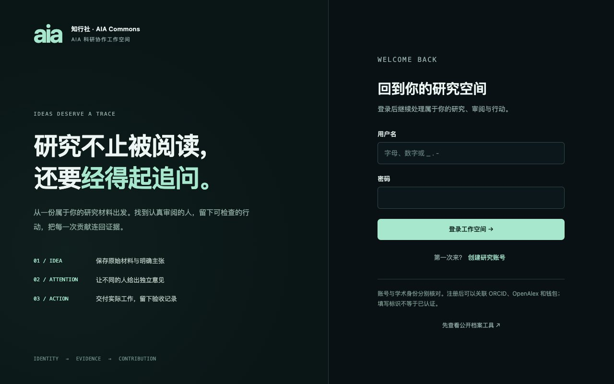<br><sub>图 14 · 真实界面：知行社协作空间入口（已实现账号、研究材料、审阅、任务交付与三人验收）</sub></p>

**知行社长成后的样子**：学者投稿时附上的，是一枚任何人都能复核的红章，期刊据此知道这个人是谁、论文归属对不对、过去的审稿与复现记录如何；审稿人的每一份被采纳的意见都留下记录，攒下廌点与履约；复现者第一次被看见，复跑一个主张、指出一处错误，和发一篇论文一样会被记住；期刊与机构为这层公共设施出资，因为高信誉作者和认真的审稿人替它们省下了筛查成本。**没有人拥有它，但每个人都能用它、改进它。**

---

## 7. 技术架构与数据处理

### 7.1 分层

| 层 | 内容 |
|---|---|
| 应用层 | 学术体检（学者）· 期刊查询台（期刊）· 知行社（社区）· 任何第三方应用 |
| 流程层 | Idea：投稿登记 / 结案 · Attention：审稿 · Act：复现 / 核对 / 认领 |
| 信誉层 | 学术档案（公开数据 + Agent 交叉验证）· 灋廌学术分 · 廌点 |
| 链层 | BOT Chain：ActionRegistry（行为登记）· PointsLedger（廌点账本） |

### 7.2 链上与链下的边界

| 数据 | 存在哪里 | 说明 |
|---|---|---|
| 学者标识 | 链上 | `keccak256("openalex:<作者编号>")`，不含姓名 |
| 评分 | 链上 | 0–100 的数值 + 快照指纹 + 规则版本；显示分 = 350 + 6 × 数值 |
| 认领凭证、稿件 | **链上只存指纹**，原文在链下 | 任何人拿原文可重算指纹核对 |
| 姓名、单位、论文元数据 | 链下（来自公开数据源） | 不上链（链上记录无法删除） |
| 邮箱 | 只存哈希，写在凭证中 | 不存原文 |
| 廌点余额与流水 | 链上 | 每笔带原因编号与证据指纹 |

<p align="center">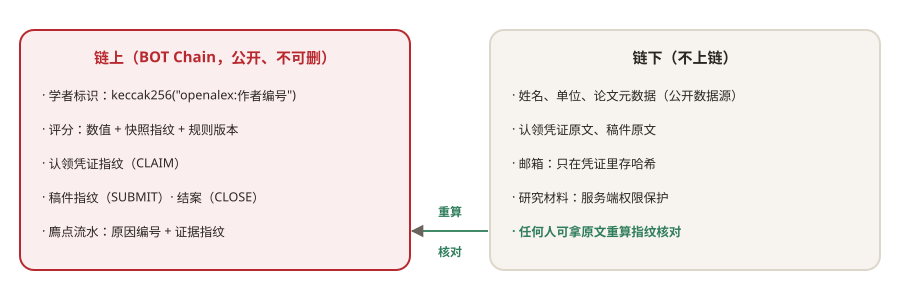<br><sub>图 15 · 链上与链下的数据边界</sub></p>

### 7.3 读写权限

- **读**：任何人可直接读链（按人查时间线、按指纹查所有登记），不依赖本项目后端；同一笔记录，学术体检和期刊查询台两个应用都读得到
- **写**：评分与认领由平台服务账户写入；廌点只有登记的发放方地址能写；期刊登记使用公开的期刊地址（名单治理【规划中】）
- **服务端防护**：写链默认关闭，需服务端显式开启；写操作只接受同源请求；页面禁止内联脚本；主网私钥不进代码仓库

### 7.4 部署

| 网络 | 用途 |
|---|---|
| BOT Chain 主网（Chain ID 677） | 正式记录；合约地址与交易见附录 C |
| BOT Chain 测试网（968） | 开发测试 |
| 本地模拟链（1337） | 现场演示：秒级确认、不消耗主网手续费；只使用公开的开发测试私钥 |

---

<div class="pb"></div>

## 8. 验证方法、结果与适用限制

本节区分三种证据：**实现正确性**（代码是否按规格工作）、**有限样本观察**（分数在样本上的表现）、**机制模拟**（规则在假设人群下的行为）。三者都**不等于**真实机构环境下的运营效果。

| 验证对象 | 方法 | 结果 | 说明了什么 | 没有说明什么 |
|---|---|---|---|---|
| 评分规格 = 代码 = 链上 | 按规格书公式独立重算 5 位学者；读取主网评分记录 | 差值全部为 0；主网记录与代码一致（656） | 公式、代码、链上记录一致 | 公式本身是否合理 |
| 对照组排序 | 已知应高、应低、应「证据不足」的学者 | 何恺明 788 > 新人 656 > 两个大规模撤稿案例 464 / 470 | 极端情况下方向正确 | 中间人群的区分度 |
| 与 h 指数的关系 | OpenAlex 随机抽取 30 位论文 > 20 篇的学者 | Spearman ρ = 0.46 | 与影响力中等正相关，不是简单复制 h 指数 | 30 人样本，学科与地区代表性有限 |
| 论文少的学者 | 随机 30 位论文 3–9 篇的学者 | 30 / 30 落在 600–700 | 证据少时不轻易下结论 | — |
| 稳定性与单调性 | 同一人重算；人为加撤稿、提高履约 | 结果不变；加撤稿必降、履约好必升 | 规则行为符合设计 | — |
| 防作弊（机制模拟） | 12 个月蒙特卡洛（见 5.5） | 后三类人占审稿注意力：一刀切 63%，本规则 30% | 在设定假设下规则能区分人群 | 真实运营效果 |
| 本人认领流程 | 在真实 OpenAlex 数据 + 本地链上跑 6 个场景（2026-10-07） | 认领、错码拒绝、ORCID 不符拒绝、篡改复核失败、非单位邮箱灰章、手机布局，全部通过 | 流程按设计工作 | 真实邮件环境；大规模并发 |

以上评分相关检查合计 17 项自动验收，全部通过（`aia/product/acceptance.py`，每项通过标准事先写在脚本里）。

**一次更正**：早先报告的「与 h 指数相关 0.83」有误，原因是把论文少与论文多的两群人混在一起抽样；按人群分开重测后为 0.46。

**适用限制**

1. 评分依赖 OpenAlex 的收录与作者消歧，未收录的成果无法反映；中文姓名的拼写变体可能导致漏检
2. **人工盲评尚未完成**：计划由熟悉学者的人先不看分数排序，再与评分比对
3. 合作网络维度尚未实现（记中性）；多人勾结互审需要利益冲突回避规则
4. 参数（20、30、750、830 等）为第一版，可通过模拟脚本调整后重跑
5. 免费 OpenAlex 额度约每天 1000 个查询单位，规模化需申请 API key

---

## 9. 隐私、安全与风险边界

| 风险 | 做法 |
|---|---|
| 链上记录无法删除 | 只放哈希与分数；姓名、单位、邮箱不上链 |
| 冒充他人认领 | 验证码限时限次；单位邮箱核对；ORCID 不符即拒绝；非单位邮箱只能得到「待复核」灰章 |
| 小号刷分 | 零论文账号拿不到新手廌点，投稿按最低档 |
| 乱答任务 | 同题多人比对 + 暗题 |
| 服务被滥用写链 | 写链默认关闭；同源请求；禁止内联脚本 |
| 红章被误读 | 每处红章就近说明含义：「指纹已登记 / 本人认领」，**不是**对研究质量的背书 |
| 公开点名 | 学术分不等于人品分；低分案例只用于内部验证，不在公开材料中点名个人 |

---

## 10. 机构接入：评估要点

**现在就能做**：直接读链查询某位学者的评分、认领、投稿与结案记录；按稿件指纹查询是否被其他期刊登记。

**机构需要准备**：一个公开的登记地址（用于写入收稿与结案记录）；收稿时计算指纹并登记的流程；收到疑似一稿多投提示后的核查与处置流程。

**责任划分**：系统负责记录与提示；**机构负责核查、处置和与作者沟通**；学者对自己的认领声明负责。

**待补充（尚未具备，不作承诺）**：服务等级与支持范围、数据处理协议、异常与争议处理流程、批量接口规格、价格。这些将与首批期刊共同确定。

---

## 11. 可持续、治理与路线图

### 11.1 钱从哪来

| 谁 | 付不付费 | 得到什么 |
|---|---|---|
| 学者 | 免费 | 体检、认领、盖章、挣廌点 |
| 期刊 / 会议 | 付费 | 收稿登记、一稿多投查询；附可信报告的稿子省掉筛查 |
| 高校 / 基金 / 招聘方 | 付费 | 批量核验、接口调用【规划中】 |

与 ORCID 依靠机构会员费运转、Crossref 查重「先贡献数据才能使用」是同一思路。机构费用用于链上手续费、服务器与廌点兑换激励。**我们从不出售廌点，也不出售分数**；价格与首批期刊共同商定。

曾有学术平台发行代币奖励审稿，代币价格大幅下跌后激励随之失效。我们的结论是：**激励要绑在人和行为上，不能绑在会涨跌的价格上。**

**增长飞轮**：期刊登记 → 数据变多 → 查询更准 → 更多期刊与学者加入；合作者邀请（一人认领后邀请其论文合作者）和 Act 区核对任务持续改善数据质量。

### 11.2 治理

- **规则版本化**：每次评分、每笔廌点都带版本号上链；改规则即换版本号，不改历史
- **发放方名单**：只有登记地址能写；接入方公开自己的地址
- **复核与申诉**：凭证可重算；争议认领进入「待复核」，复核通过才发廌点
- **参数可调**：模拟脚本改参数即可重跑验证
- **走向社区**：长期由知行社贡献者共同维护规则与名单

### 11.3 路线图

| 阶段 | 内容 |
|---|---|
| 已完成（2026 年 10 月） | 主网合约；Agent 检索与三方交叉验证；学术分 v2.1；本人认领与复核；廌点发放；稿件预检与指纹登记；一稿多投提示 |
| 3 个月 | 押金合约；ORCID 登录授权；真实邮件验证；Act 区核对任务；廌点有效期 |
| 6–12 个月 | 首批期刊接入；审稿与复现任务；双模型论文评审；Agent 接入；合作者邀请 |
| 长期 | 知行社 · AIA Commons：多方共同治理的学术信誉公共品 |

---

## 12. 团队、邀请与声明

**Know & Act（知行合一）**：来自河海大学等高校的博士生与开发者，参加汉客松 S1 · ETH Wuhan 2026（GCC 公共物品赛道 · BOT Chain 赛道）。我们的名字就是主张：**知道自己是谁（知），也为学术社区做点事（行）。**

**邀请**

- **学者**：来查一下自己，认领你的论文，盖下第一枚红章
- **期刊或会议**：来登记你的收稿，一起识别一稿多投
- **开发者**：规则与合约都开源，可以直接读链、接入、复算、挑错

**声明**

1. 本协议**不发行**任何虚拟货币或代币，不进行任何形式的募资，不构成投资建议
2. 廌点是服务内的贡献记录，**不能转让、不能兑现、不能买卖**
3. 灋廌学术分只反映公开学术记录的可信程度，**不是人品评价**，不代替同行评议
4. 标注【规划中】的功能可能调整；参数以开源仓库最新版本为准
5. 数字出处：投稿量来自公开报道；模拟与验收结果来自仓库脚本实跑；链上地址与交易来自部署记录

---

<div class="pb"></div>

## 附录 A：合约字段

**ActionRegistry（学术行为登记）**

| 字段 | 含义 |
|---|---|
| `subject` | 学者标识 `keccak256("openalex:<作者编号>")` |
| `kind` | `SCORE` 评分 · `SUBMIT` 投稿 · `CLOSE` 结案 · `REVIEW` 审稿 · `REPRODUCE` 复现 · `CLAIM` 认领 |
| `content` | 内容指纹：稿件、认领凭证或评分快照的哈希 |
| `org` · `rule` · `value` | 登记机构、规则版本、数值（仅评分使用，0–100） |
| `recorder` · `time` | 登记地址、时间 |

查询：`actionsOf(subject)` 返回某人的完整记录；`actionsByContent(content)` 返回同一指纹的全部登记。

**PointsLedger（廌点账本）**：只有 `award`（发放）与 `spend`（扣减，余额不足即失败），无 `transfer` / `approve`；只有登记的发放方可写；每笔事件记录原因编号、证据指纹、发放方与余额。

## 附录 B：评分公式

```
公开部分 = (0.20·身份 + 0.30·履历 + 0.20·习惯 + 0.10·合作) / 0.80
证据权重 w = n / (n + 10)            n = 论文数
收缩后公开部分 = 0.5·(1 − w) + 公开部分·w
综合 = 0.80·收缩后公开部分 + 0.20·履约
学术分 = 350 + 6 × round(100 × 综合 × (1 − min(0.7, 3 × 撤稿率)))
```

各维度的细项定义见 `aia/product/SCORING_SPEC.md`（规则 `checkup-v2`，v2.1）。

## 附录 C：BOT Chain 主网部署与交易

| 合约 | 地址 |
|---|---|
| ActionRegistry | `0xA0853161002Af018225419324560FCE9CD9b10eD` |
| PointsLedger | `0x28B2af15386C0D65D5427d5b81bEe485D4edD60A` |

已有真实交易：三位学者的评分（656 / 704 / 788）、两家演示期刊登记同一稿件（触发一稿多投提示）、新手保护 +20、认领错挂 +5。完整交易哈希见 `aia/chain/MAINNET.md`，可在 https://scan.botchain.ai 查询。

<p align="center">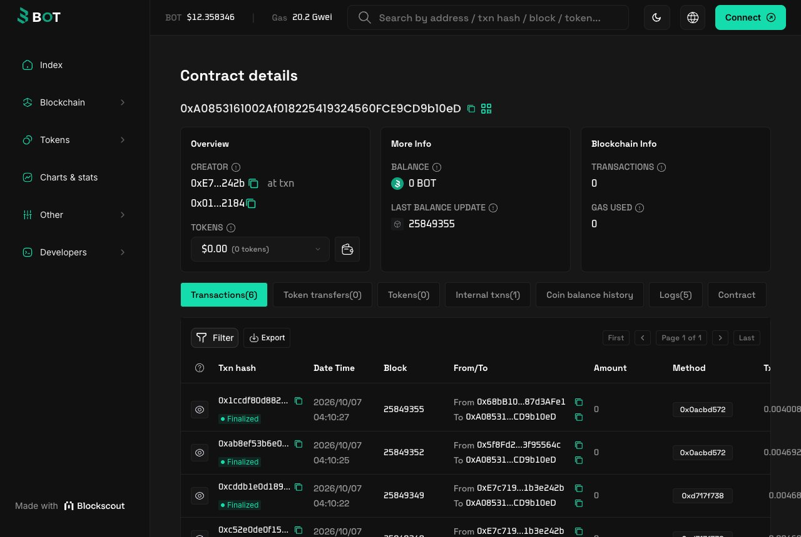<br><sub>图 16 · BOT Chain 主网浏览器：ActionRegistry 合约及其交易记录（状态 Finalized）</sub></p>

## 附录 D：复算命令

| 内容 | 命令 / 文件 |
|---|---|
| 评分自动验收 | `python3 aia/product/acceptance.py` |
| 廌点模拟与不变量 | `python3 aia/product/points_model.py` |
| 读取某位学者的链上记录 | `node aia/chain/read.mjs <作者编号>` |
| 运营规则 | `plan/RULES.md` |
| 认领流程测试记录 | `plan/UX_CLAIM.md` |
