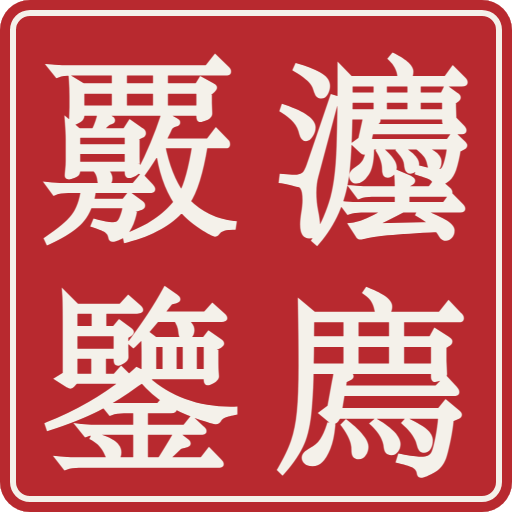

> ⚠ 已归档：本文已合并进 [《AIA 社区白皮书》正式版](../AIA_COMMUNITY_WHITEPAPER.md)，以那份为准。

<p align="center">　</p>

# 愿景书：从 AIA 到知行社

**灋廌覈鑒 · Xiezhi** · Know & Act（知行合一）· 2026-10-07

---

## 两千年前，「法」字里就住着一个判官

「法」的古字写作**灋**。《说文》：「灋，刑也。平之如水，从水；廌所以触不直者去之，从去。」
左边是水：公平如水。右边是**廌**，也就是獬豸：一只独角神兽，见到不正直的人就用角去顶。

我们把这只神兽请到链上，取名**灋廌覈鑒**（读作「法廌核鉴」）：**以獬豸之法，核实明鉴。**

## 我们看到的问题

AI 让写论文变得很容易，**注意力**却成了学术圈最稀缺的东西：审稿人被灌水稿耗尽，复现没人做，论文挂错人也没人管。

学者本人也很无奈：我们查了一下队长自己，**他的一篇论文挂在一位上海交大研究燃烧的同名学者名下**。连「这篇论文是谁的」都会错，信任从哪里来？

现在的办法是一刀切：每人每年最多投多少篇。可**篇数能分摊给别人，信誉分摊不了。**

## 三层名字，一条线

| 层 | 名字 | 是什么 |
|---|---|---|
| 理念 | **AIA** | Attention（注意力）· Idea（想法）· Act（行动） |
| 今天能用的协议 | **灋廌覈鑒** | 学术信誉链：查人、认领、评分、上链，规则公开、谁都能复算 |
| 长大以后的样子 | **知行社 · AIA Commons** | 一个由贡献者共同维护的学术公共品社区 |

### AIA：学术圈的三种稀缺

- **Idea（想法）**：论文和研究主张。AI 让它变多了，所以需要门槛，而不是封顶
- **Attention（注意力）**：审稿人的时间。最稀缺，只该花在过了门槛的稿子上
- **Act（行动）**：复现、核对、纠错。最缺人做，所以要被看见、被记账

```
Idea（投稿）──消耗──▶ Attention（审稿人的注意力）
   ▲                         │
   │ 档位与押金门槛            │ 高分者审稿 → 廌点 + 履约
   │                         ▼
Act（复现、核对）◀──想修信誉的人做任务── 廌点
```

**新人**做核对和复现，涨分；**大牛**审稿，成为审稿专家；**失信者**投稿要先押廌点，只能先动手修复信誉。每一类人都有往上走的路，也都在为社区出力。

## 我们相信的五件事

1. **信誉不属于任何一家公司。** 记录在公链上，没有运营方能偷偷改，包括我们自己；我们消失了，记录还在
2. **规则公开，谁都能复算。** 评分规则开源、带版本号；任何人拿同一份快照，算出同一个分数
3. **人人都有一页，不用等注册。** 用公开数据自动建档；本人来认领，是为了纠错和确认，不是门槛
4. **只记指纹，不记隐私。** 链上只放哈希和分数，不放姓名、单位、邮箱
5. **激励绑在行为上，不绑在价格上。** 不发币；用**廌点**记录贡献，不能转让、不能买卖（见《廌点白皮书》）

## 今天已经做到的

- 两个合约部署在 **BOT Chain 主网**，评分与廌点都有真实交易
- 输入名字或 ORCID，Agent 实时检索、交叉验证（OpenAlex × ORCID × Crossref），发现错挂和被拆分的档案
- **灋廌学术分**（350–950）规则冻结，17 项自动验收全部通过
- **本人认领**：逐篇确认 → 邮箱验证 → 生成认领凭证 → 盖红章上链 → 任何人可复核
- 一稿多投识别：两家期刊登记同一稿件指纹，系统亮红灯

## 知行社会是什么样子

**一年后**：一个学者投稿时，附上的不是一份自己写的简历，而是一枚**任何人都能复核的红章**。期刊看到红章就知道：这个人是谁、论文归属对不对、过去的审稿和复现记录如何。

**审稿人**不再白干：每一份被采纳的审稿意见，都在链上留下记录，攒下廌点和履约，成为更高档位的审稿专家。

**复现者**第一次被看见：复跑一个主张、指出一处错误，和发一篇论文一样会被记住。

**期刊和机构**为这层公共设施出资，因为高信誉作者和认真的审稿人替它们省下了筛查的功夫。

**没有人拥有它，但每个人都能用它、改进它。** 这就是知行社 · AIA Commons：知道自己是谁（知），也为社区做点事（行）。

## 邀请

如果你是**学者**：来查一下自己，认领你的论文，盖下第一枚红章。
如果你是**期刊或会议**：来登记你的收稿，一起识别一稿多投。
如果你是**开发者**：规则和合约都开源，三行代码就能读链，欢迎接入、复算、挑错。

> **知行合一：知道自己是谁，也为学术社区做点事。**

---

延伸阅读：《廌点白皮书》（同目录 `ZHIDIAN_WHITEPAPER.md`）· 当前定稿 `plan/CURRENT.md` · 运营规则 `plan/RULES.md`
